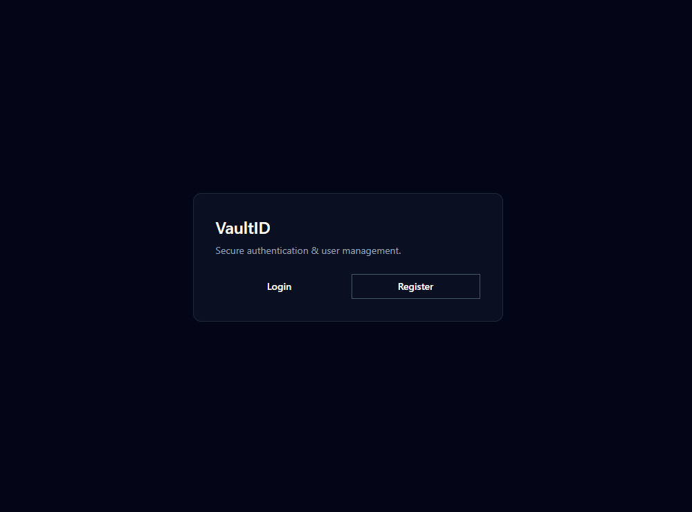
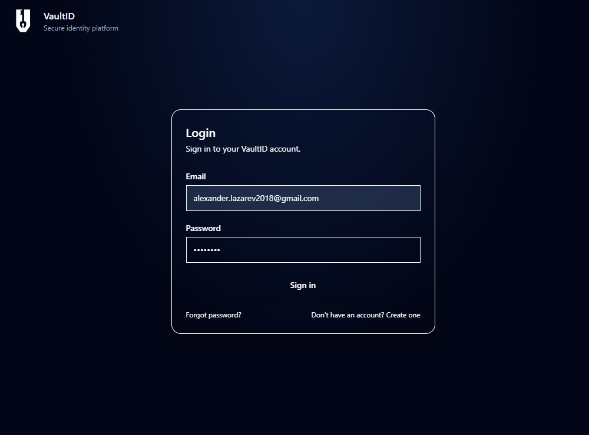
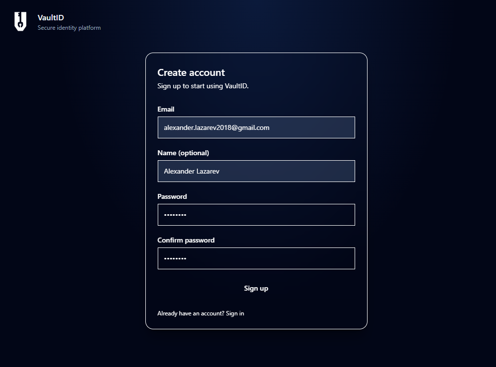
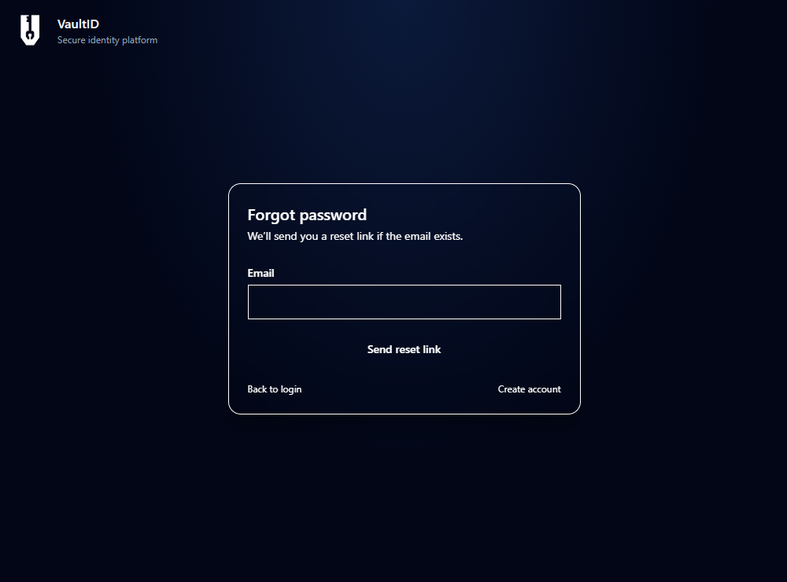
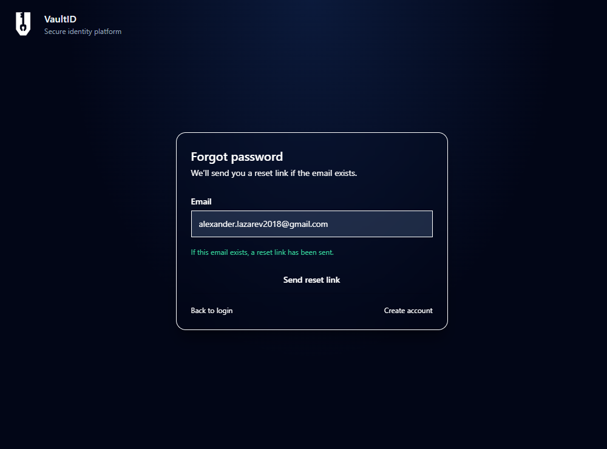
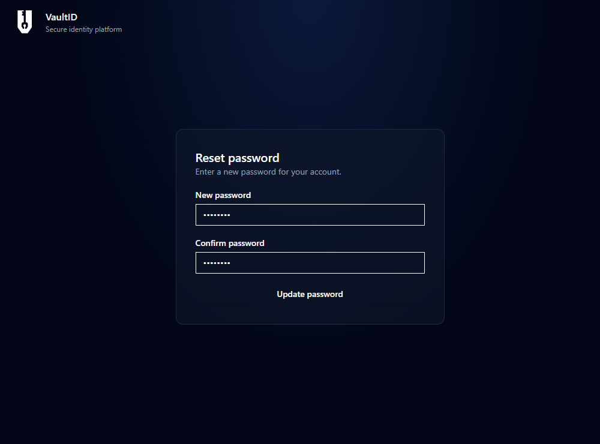
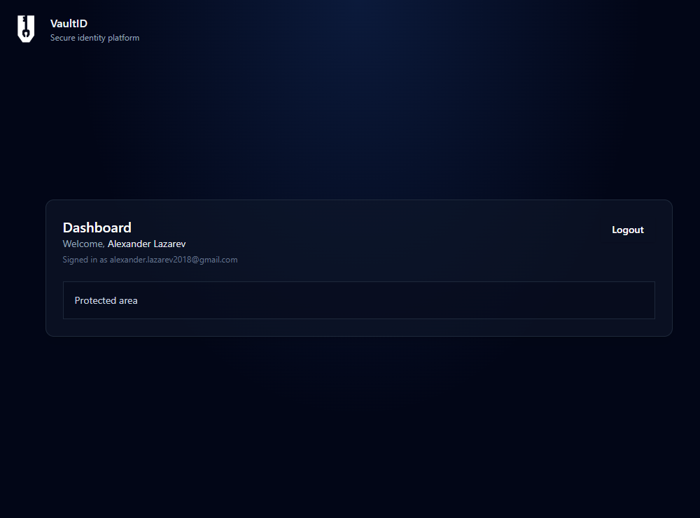

# VaultID Frontend

Frontend application for VaultID, an authentication system.

## Live Demo
[https://vaultid-frontend.onrender.com](https://vaultid-frontend.onrender.com)

The live demo is hosted on Render’s free tier and may be unavailable at times due to cold starts or service limits.

## Tech Stack
* **Next.js** (App Router)
* **TypeScript**
* **Tailwind CSS**
* **Zustand** (authentication state)
* **Axios** (API client)
* **Zod + React Hook Form**

## Features
* User registration & login
* Email verification flow
* Password reset flow
* Token-based authentication (JWT + refresh tokens)
* Automatic access token refresh
* Protected dashboard
* Deployed as a static site on Render

## Environment Variables
```env
NEXT_PUBLIC_API_BASE_URL=https://vaultid.onrender.com
```

## Local Development
```bash
npm install
npm run dev
```

**Application runs on:** [http://localhost:3001](http://localhost:3001)

## Backend
This frontend consumes the VaultID backend API:  
[https://github.com/allaz002/vaultid](https://github.com/allaz002/vaultid)

## Screenshots
### Start


### Login


### Register


### Email Verification Pending


### Password Reset




### Dashboard
